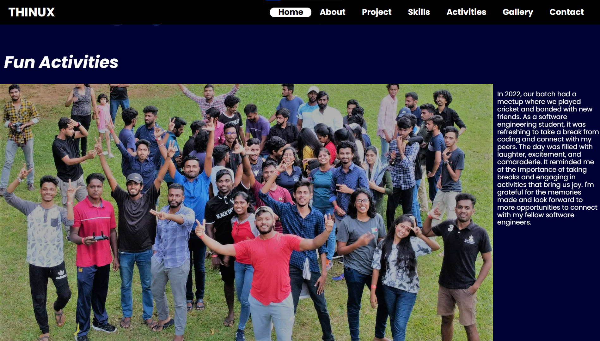
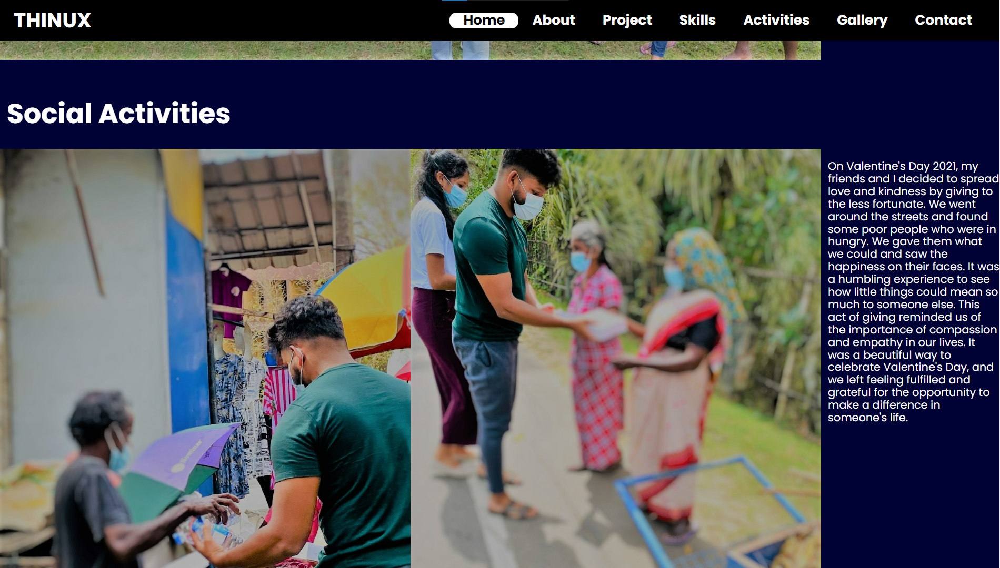

------------------------------------------------------------------------------------------------------------ 

<h3><h3>
Technology & Frameworks
<ul>
  <li>HTML</li>
  <li>CSS</li>
  <li>JS</li>
  <li>Bootstrap</li>
  <li>Jquery</li>
</ul>
-----------------------------------------------------------------------------------
-----------------------------------------------------------------------------------
-----------------------------------------------------------------------------------
<h3>References</h3>

Site Map :  https://drive.google.com/file/d/1ESk1I7ZwZgClJ7AAyOzN6IDS_rNFz4m9/view?usp=sharing

Wireframe : https://drive.google.com/file/d/10p3sj3qHi6CaiN_qZ62byoMPzxxCdIUr/view?usp=sharing

Mockup : https://www.figma.com/file/jsnzX9tAUBobVDK5q5PuhY/Portfolio?type=design&node-id=13%3A3&mode=design&t=EhweMMOpc36opEkZ-1

---------------------------------------------------------------------------------------------- 

<h3>Deployment</h3>
GitHub Pages : https://github.com/THINUX-Official/my-portfolio.git  

---------------------------------------------------------------------------------------------- 

<h3>Developed By THINUX</h3>
------------------------------------------------------------------------------------------------------------ 
------------------------------------------------------------------------------------------------------------ 
------------------------------------------------------------------------------------------------------------ 

******************************************************************************************** 
******************************************************************************************** 
 

Developed By Dushan Malinda

<h>Desktop View</h3>

